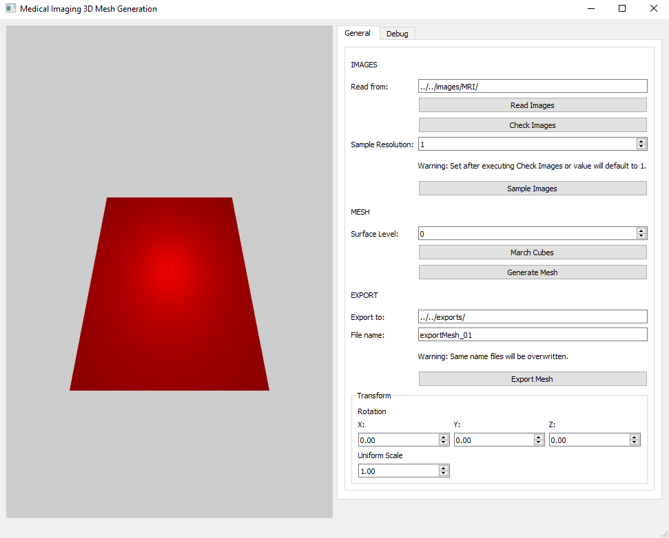
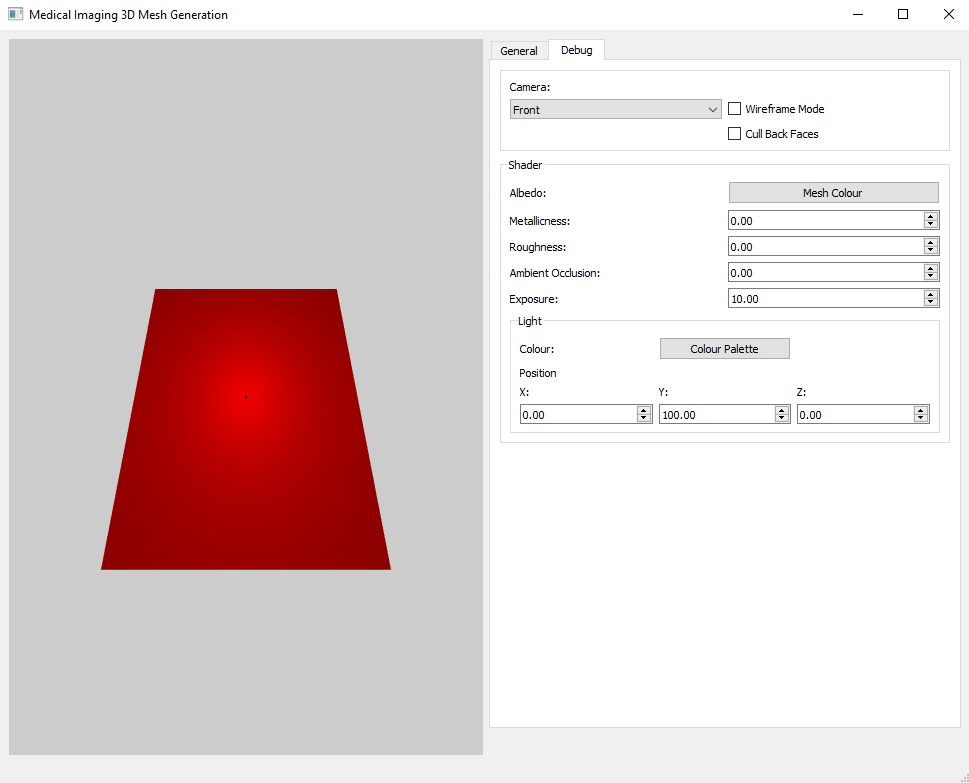
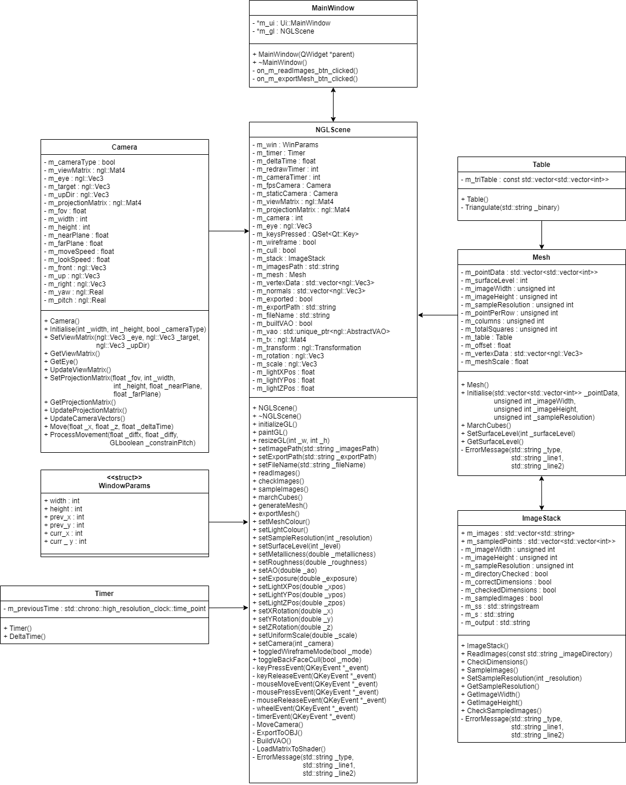
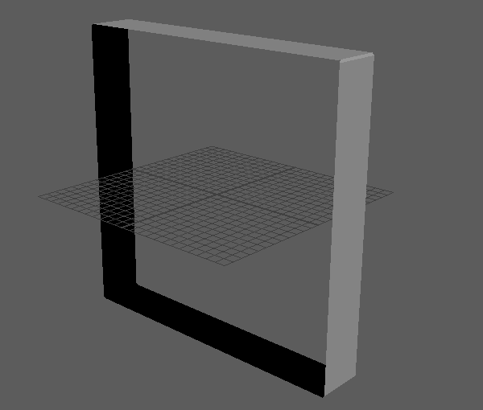
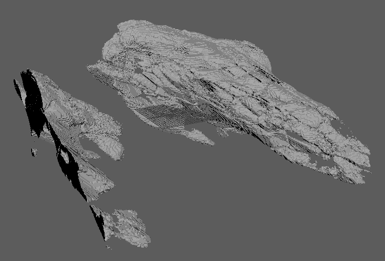
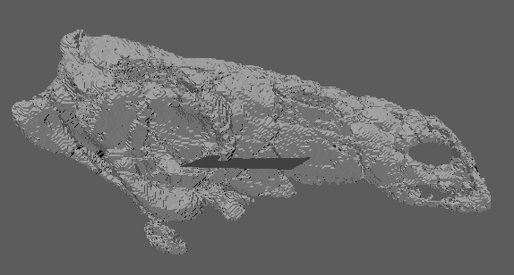
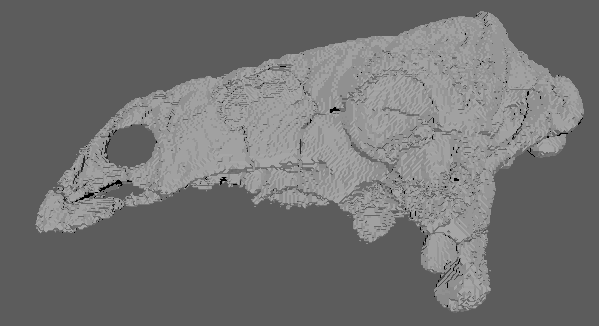
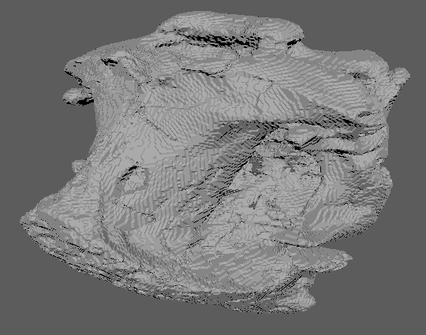
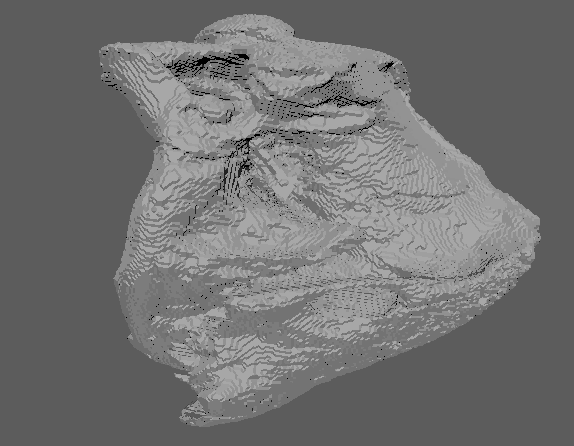
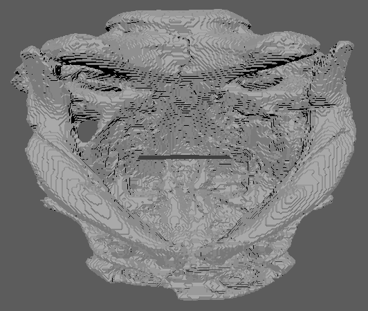

# Medical Imaging 3D Mesh Generation
*Josh Bailey*<br />
*Animation Software Engineering / CGI Techniques.*<br />
*NCCA, Bournemouth University.*<br />
*2020 - 2021.*<br />

## Contents
1. [Overview](#overview)
2. [Project Setup](#project-setup)<br />
	2.1. [Windows](#windows)<br />
  2.2. [Mac](#mac)<br />
	2.3. [Linux](#linux)
3. [Usage](#usage)<br />
  3.1. [GUI](#gui)
4. [Technical Details](#technical-details)<br />
	4.1. [UML Diagram](#uml-diagram)<br />
	4.2. [Main Components](#main-components)<br />
    4.3. [Dependencies](#dependencies)
5. [Tested Data](#tested-data)
6. [References](#references)
7. [Additional Reading Material](#additional-reading-material)

## Overview
The purpose of this software is to be used as a 3D visualisation tool for bones and organic structures. This software works by converting medical scan images into a 3D digital model, using the Marching Cubes algorithm.

## Project Setup
### Windows
1. Enter the root directory of the project
2. Create a 'build' directory and enter it
3. Run "cmake .."
4. Run "cmake --build ."
5. Enter the 'Debug' directory
6. Run 'ase-cgitech-JoshhhBailey.exe'

**Note:** If you encounter any build errors with IlmBase and/or OpenEXR, add the following lines to the CMakeLists.txt:
```cpp
find_package(IlmBase CONFIG REQUIRED)
find_package(OpenEXR CONFIG REQUIRED)
```
Underneath this line:
```cpp
find_package(freetype CONFIG REQUIRED)
```
Then re-do steps 4-6.

### Mac
1. Enter the root directory of the project
2. Create a 'build' directory and enter it
3. Run "cmake .."
4. Run "make"
5. Run './ase-cgitech-JoshhhBailey'

### Linux
1. Enter the root directory of the project
2. Create a 'build' directory and enter it
3. Run "cmake .."
4. Run "cmake --build ."
5. Run 'ase-cgitech-JoshhhBailey.exe'

## Usage
1. Enter the directory containing your images, in the "Read from:" text box
2. Click "Read Images"
3. Click "Check Images"
4. Adjust the "Sample Resolution"<br />
   **Note:** Sample resolution dictates how often your images are sampled. For example, a sample resolution of 5 will sample every 5 pixels of every 5 images.
	The greater your sample resolution, the faster the algorithm will run. However, the less detailed the generated mesh will be.
5. Click "Sample Images"
6. Adjust the "Surface Level"<br />
   **Note:** Surface level dictates the colour value of the isosurface of interest, and above. Colour values >= will be drawn.
7. Click "March Cubes"
8. Click "Generate Mesh"
9. Enter the directory you wish to export your mesh to
10. Enter the name you wish to call your exported mesh<br />
	  **Note:** Mesh will be exported as an .obj
11. Click "Export Mesh"

Optional:
- Independent adjustment of each rotational axis
- Uniform adjustment of mesh scale
- Change camera view<br />
  **FPS Camera Controls:** LMB drag on graphics window to look. WASD to move.
- Activate "Wireframe Mode"
- Activate "Cull Back Faces"
- Change Mesh Colour (albedo)
- Change Metallicness
- Change Roughness
- Change Ambient Occlusion
- Change Exposure
- Change Light Colour
- Change Light Position

### GUI




## Technical Details
### UML Diagram


### Main Components
#### ImageStack
An ImageStack object contains a collection of images that can be later used to generate a mesh. This component specifically handles reading images from a directory, checking their dimensions, and sampling their colour data. The way their colour data is sampled, is as follows...

The collection of images is iterated based on a user defined variable called 'sampleResolution'. A 'sampleResolution' of 1 will iterate over every image, a 'sampleResolution' of 5 will iterate over every 5 images. For every 'sampleResolution' number of images, each image will have its colour value read at specific coordinates (again dependent on 'sampleResolution'). As medical images are typically only black and white, only one colour channel needs to be read, as the others will hold an identical value. Each images colour values are then stored in their own list.

```cpp
int numberOfImages = 40;
std::vector<std::vector<int>> sampledPoints;
sampleResolution = 4;

for (int z = 0; z < numberOfImages; z += sampleResolution)
{
    for (int y = 0; y < imageHeight; y += sampleResolution)
    {
        for (int x = 0; x < imageWidth; x += sampleResolution)
        {
            colour = GetColour(x, y)
            sampledPoints[imageIndex].push_back(colour);
        }
    }
}
```

#### Mesh
A Mesh object uses the sampled colour data of an ImageStack object and processes the data to generate a 3D model. Each images colour data is stored as a one dimensional list (in this case: 0 = no colour, 1 = colour):
```cpp
sampledPoints[image0] = { 0, 1, 1, 1, 1, 1, 1, 0, 0, 0, 1, 1, 1, 1, 1, 0 };
sampledPoints[image1] = { ... };
```
However, the data actually needs to be interpreted as a grid:
```cpp
sampledPoints[image0] = { 0, 1, 1, 1, 
                          1, 1, 0, 0,
                          1, 1, 1, 1,
                          0, 0, 1, 0 };
sampledPoints[image1] = { ... };
```
In order for the Marching Cubes algorithm to be applied, it requires two sets of 4 vertices (squares) to create a cube. In this case of a 4x4 grid of sampledPoints, per image...
```cpp
//     1  2  3  4
//     5  6  7  8
//     9 10 11 12
//    13 14 15 16
// Their are 9 total squares...
//    1 2   2 3   3 4   5  6    6  7    7  8    9 10   10 11   11 12
//    5 6   6 7   7 8   9 10   10 11   11 12   13 14   14 15   15 16
```
These squares of data can be used in conjunction with their parallel squares from a consecutive image in order to create a cube. This cube can then be used for the Marching Cubes algorithm.

The algorithm checks the colour value of each of the 8 points that make up a cube and determines, in this case, whether their colour value is 0 or 1. Depending on the colour value, each point will be assigned a binary digit, that will contribute to a string.

```cpp
//     Layer 1    Layer 2
//     1  2       1  2
//     5  6       5  6

// Example string output = 00101000
```

This string is then passed to a [Table](#table) object and converted into a base 10 number.

```cpp
// 00101000 = 40
```

Index 40 of the Triangulation table is then found and returns a list of edges that need to be connected.

```cpp
// Index 40 = {9, 5, 4, 2, 3, 11, -1, -1, -1, -1, -1, -1, -1, -1, -1, -1}
```

Edges 9, 5, 4 and 2, 3, 11 create the triangles that must be drawn to the screen.

The way to calculate the location of these triangles is to convert each of the sampledPoints indexes to represent a point in 3D coordinate space. As our 'sampleResolution' is 4, meaning every 4th image has been sampled at every 4th pixel, we can determine the position of each point, for example:
```cpp
// sampledPoints[image0][0]  = X:  0,  Y:  0,  Z:  0
// sampledPoints[image0][5]  = X: 12,  Y:  4,  Z:  0
// sampledPoints[image0][7]  = X:  8,  Y:  4,  Z:  0
// sampledPoints[image0][15] = X: 12,  Y: 12,  Z:  0

// First index of sampledPoints = Z Coordinate
// sampledPoints[image0] = Z: 0
// sampledPoints[image1] = Z: 4
```
In this case, the edge points lie exactly half way between two sampledPoints indexes, so an offset is uniformly applied. These coordinates can then be calculated for each cube and then passed to OpenGL as a list of points in 3D coordinate space for rendering.

#### Table
A Table object stores a triangulation table of all edge configurations available within this implementation of the Marching Cubes algorithm.

### Dependencies
- NGL Graphics Library - https://github.com/ncca/ngl
- Qt - https://www.qt.io/
- CMake (Recommended) - https://cmake.org/<br />
  **Note:** Optionally you can use Qmake - https://wiki.qt.io/Qmake
- C++17

## Tested Data
**Test Data** -> *Surface Level: 100, Sample Resolution: 5*<br />


**Pawpawsaurus campbelli** -> *Surface Level: 150, Sample Resolution: 4*<br />
Paulina-Carabajal, A., Lee, Y.-N. and Jacobs, L. L., 2016. *Pawpawsaurus campbelli* [online]. Digital Morphology. Available from: http://www.digimorph.org/specimens/Pawpawsaurus_campbelli/ [Accessed 29 December 2020].

**Raw Output:**


**Fusing Halves Together:**<br />



**Spathorhynchus fossorium** -> *Surface Level: 100, Sample Resolution: 4*<br />
Müller, J., Hipsley. A. C. and Maisano, A., 2016. *Spathorhynchus fossorium* [online]. Digital Morphology. Available from: http://www.digimorph.org/specimens/Spathorhynchus_fossorium/ [Accessed 29 December 2020].





## References
Bailey, J., 2020. *Medical Imaging 3D Mesh Generation* [personal collection].

Bourke, P., 1994. *Polygonising a scalar field* [online]. Available from: http://paulbourke.net/geometry/polygonise/ [Accessed 12 November 2020].

Custodio, L., Pesco, S. and Silva, C., 2019. An extended triangulation to the Marching Cubes 33 algorithm. *Journal of the Brazilian Computer Society* [online], 25 (6).

Lorensen, W. E. and Cline, H. E., 1987. Marching Cubes: A High Resolution 3D Surface Construction Algorithm. *ACM SIGGRAPH Computer Graphics*, 21 (4), 163-169.

## Additional Reading Material
NVIDIA Corp., 2007. *GPU Gems 3* [online]. NVIDIA Corp.
